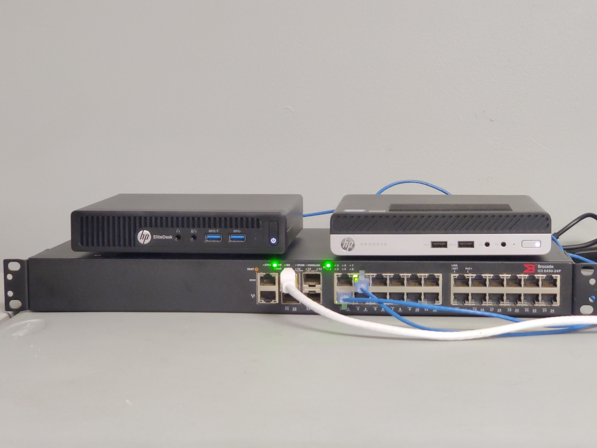

# Connecting-Proxmox-cluster-nodes-to-a-WiFi-network
Connecting Proxmox cluster nodes to a WiFi network

<div align="center">

</div>
<br>
<br>
 Proxmox , # WiFi , # information security  

https://debian-facile.org/doc:reseau:wpasupplicant  

## Prerequisites  

**Equipment requirements**  

   ⚡ **2x nodes with WiFi module*
   ⚡ **Wi-Fi «FreeWiFI»*
   ⚡ **Password "YourPassword"*  

**To connect the Wi-Fi interface on each node and connect the nodes via the Wi-Fi network, you must perform the following steps:**  

## 1. Connecting the Wi-Fi interface  

**Installing the required packages**  

*Install Wi-Fi packages on all nodes:*  
```
apt update
apt install wireless-tools wpasupplicant net-tools  
```
## 2. Find the appropriate interface:  
```
root@pve1:~# dmesg | grep wlan
[    9.795917] iwlwifi 0000:00:14.3 wlo1: renamed from wlan0
root@pve1:~#

[root@pve99 ~]$ dmesg | grep wlan
[   24.504063] mt7601u 5-1.1:1.0 wlx7601dd602347: renamed from wlan0
[root@pve99 ~]$  
```
## 3. Setting up a Wi-Fi network  

**on each node to configure Wi-Fi edit the file**  
```
 nano /etc/network/interfaces  
```
**Example file for node 1:**  
```
auto lo
iface lo inet loopback

auto wlo1
iface wlo1 inet dhcp
        wpa-ssid "FreeWiFi"
        wpa-psk "VotrePassword"
auto vmbr0
iface vmbr0 inet static
        address 10.10.3.1/24
        bridge-ports none
        bridge -stp off
        bridge-fd 0
# INTERNET
        post-up   echo 1 > /proc/sys/net/ipv4/ip_forward
        post-up   iptables -t nat -A POSTROUTING -s 10.10.3.0/24 -o wlo1 -j MASQUERADE
        post-down iptables -t nat -D POSTROUTING -s 10.10.3.0/24 -o wlo1 -j MASQUERADE
source /etc/network/interfaces.d/*  
```
**Example for node 2:**  
```
auto lo
iface lo inet loopback

auto wlx7601dd602347
iface wlx7601dd602347 inet dhcp
       wpa-ssid "FreeWiFi"
       wpa-psk "VotrePassword"

auto vmbr0
iface vmbr0 inet static
        address 10.10.3.1/24
        bridge-ports none
        bridge -stp off
        bridge-fd 0
# INTERNET
   post-up   echo 1 > /proc/sys/net/ipv4/ip_forward
   post-up   iptables -t nat -A POSTROUTING -s 10.10.3.0/24 -o wlx7601dd602347 -j MASQUERADE
   post-down iptables -t nat -D POSTROUTING -s 10.10.3.0/24 -o wlx7601dd602347 -j MASQUERADE
source /etc/network/interfaces.d/*  
```
### wpa-ssid: The name of your Wi-Fi network. wpa-psk: The network password.  

## 4. DNS configuration  
```
nano /etc/resolve.conf  
```
**Example file:**  
```
nameserver 192.168.1.254
nameserver 8.8.8.8  
```
## 5. Configuring wpa_supplicant  
```
wpa_passphrase votre-ssid votre-mot-de-passe >> /etc/wpa_supplicant/wpa_supplicant.conf  
```
```
nano /etc/wpa_supplicant/wpa_supplicant.conf  
```
**Example file:**  
```
network={
	ssid="FreeWiFi"
	#psk="*****"
	psk=360b2c805ecd920b79a370af532d2f7636bab7049ed2dc068c2dae17f5e1c38e
}  
```

#HighAvailability #DisasterRecovery #CyberSecurity #Proxmox #DevOps
